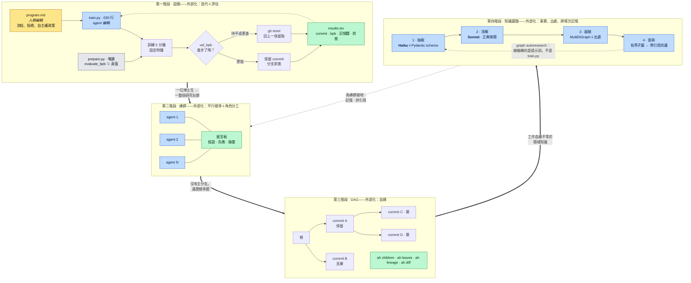
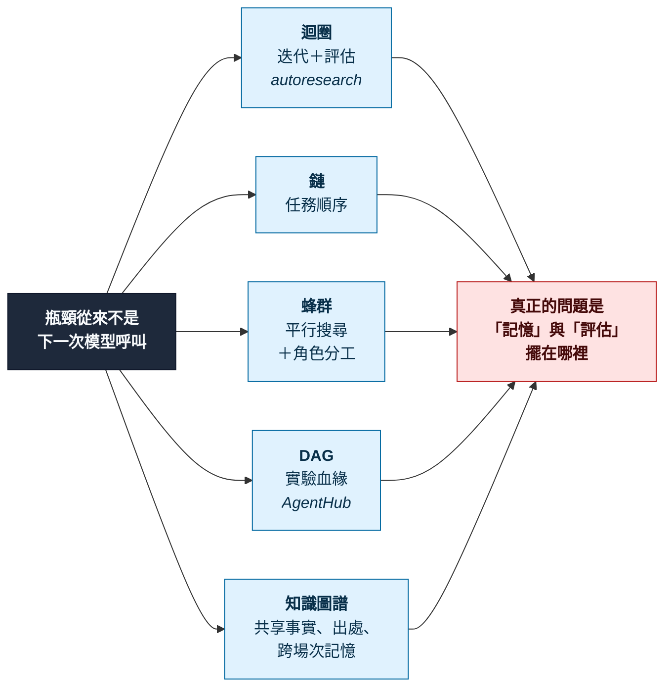
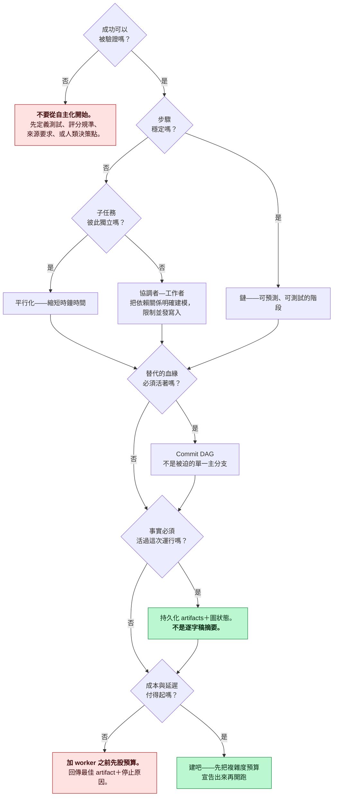

# graph-engineering-map（繁體中文版）

> 🌐 [English](./README.md) · **繁體中文**

這是一張合併的心智圖，把兩個東西放在一起讀——因為它們其實是同一個故事，只是用兩種尺度講出來：

1. **`auto-research-map`**——Andrej Karpathy 的 [`karpathy/autoresearch`](https://github.com/karpathy/autoresearch) 到底在做什麼、它擅長什麼、以及它到底會不會燒掉一大堆 token。（[獨立成篇的繁中版在這裡](./auto-research-map.zh-TW.md)。）
2. **`paper-map`**——對《Graph Engineering: The Karpathy Loop, Improved 1000x by Itself — The Anthropic Playbook》這份文件（獨立彙編，2026 年 7 月）經過 OCR 與重新結構化的精讀。

把兩者串起來的那條筋是這句話：**每一種架構，都是把某一種瓶頸「外部化」——搬到模型的腦袋外面去。** 迴圈（loop）把「反覆迭代」外部化；蜂群（swarm）把「平行搜尋」外部化；DAG 把「實驗的血緣」外部化；知識圖譜把「共享的事實」外部化。autoresearch 是第一種的最小可行實例——而那篇文件，是它之後那條路的地圖。

---

## 太長不看版（TL;DR）

| 問題 | 簡短回答 |
|---|---|
| autoresearch 是什麼？ | 一支約 630 行、跑在單顆 GPU 上的 LLM 訓練腳本，加上一份 Markdown 檔案，兩者合起來把一個 agent 變成通宵工作的研究員。它修改 `train.py`、訓練 5 分鐘，指標 `val_bpb` 有下降就保留這次修改，沒下降就 `git reset` 退回。永遠重複。 |
| 它解決什麼問題？ | 它把人類研究者的「工作記憶」——假設、死路、參數之間的交互作用——轉換成機器可讀、可續跑、可回溯的歷史。 |
| 真正的影響是什麼？ | 不是它找到的那約 20 個優化，而是它示範了一件事：**一個可驗證的指標＋一個有界的行動空間＋一個短週期＋可回退性**，就足以讓自主運作成立。94k 星星／13.3k fork 說明的是這個模式「看得懂」，不是它是最強的。 |
| 最適合的任務？ | 在一個有界、驗證便宜的表面上做局部搜尋。凡是無法驗證、高度耦合、或回饋很慢的事，它都做得很糟。 |
| **它燒不燒 token？** | **按小時算不燒——它異常節儉（每小時約 $3–$30，跟它腳下那顆 H100 同一個數量級）。按總量算會燒——因為它從不停止。** 一次 700 個實驗的完整運行 ≈ **100 萬到 700 萬個輸出 token，大約 $200–$1,500。** |

---

# 第一部：`auto-research-map`

## 1.1 這個倉庫，就事論事

以下資料是 2026-08-18 用 `gh` 即時抓取的：

| 欄位 | 值 |
|---|---|
| 倉庫 | `karpathy/autoresearch` |
| 建立／最後推送 | 2026-03-06／2026-03-26 |
| Stars／forks | 94,030／13,325 |
| 授權 | MIT |
| 重要的檔案 | `prepare.py`（389 行，唯讀）、`train.py`（630 行，**agent 就是改這個**）、`program.md`（人類改這個） |
| 指標 | `val_bpb`——驗證集上每位元組的位元數（validation bits per byte），愈低愈好，與詞彙表大小無關 |
| 預算 | 固定 **5 分鐘**的訓練時鐘時間，不含啟動與編譯 |
| 硬體 | 一顆 NVIDIA GPU（以 H100 測試） |

三個檔案的分工，就是整個設計的全部：

| 檔案 | 誰可以改 | 角色 |
|---|---|---|
| `prepare.py` | 沒有人 | 固定常數、資料準備、tokenizer、dataloader，**以及 `evaluate_bpb`——真值指標本身**。把這個檔案設成唯讀，就是防止 agent 去優化「計分板」而不是優化模型的那道鎖。 |
| `train.py` | **agent** | 模型、優化器（Muon＋AdamW）、訓練迴圈。架構、學習率、批次大小、深度——全部可以動。 |
| `program.md` | **人類** | 研究流程本身：範圍是什麼、指標與它的方向、當機政策、保留／退回規則、日誌格式、以及自主權政策。 |

> **整個倉庫裡最可轉移的一個想法：你要編寫的不是 `train.py`，而是 `program.md`。** 軟體 1.0 是寫指令；軟體 2.0 是用資料塑造行為；而這裡是用自然語言去設定一個自主運作的「組織」。用 Karpathy 的原話，`program.md`「本質上就是一個超輕量的 skill」。

## 1.2 那個迴圈

```
永遠循環：
  1. 讀取 git 狀態（目前的分支／commit）
  2. 在 train.py 裡加入「一個」有理由的修改
  3. git commit
  4. uv run train.py > run.log 2>&1     # 約 5 分鐘。不准用 tee——輸出絕不能淹沒 context
  5. grep "^val_bpb:\|^peak_vram_mb:" run.log
  6. 抓不到 → 當機了。tail -50 run.log，機械性問題就修，修不好就放棄這個想法
  7. 在 results.tsv 加一列（commit、val_bpb、記憶體、keep|discard|crash、描述）
  8. val_bpb 有進步 → 保留 commit（分支往前推）
     沒有        → git reset 退回
  永不停止。不要問人類「要繼續嗎？」——他們在睡覺。
```

有四個性質讓這個迴圈跟自主運作異常合拍。每一個都是設計決策，不是運氣：

| 性質 | 怎麼強制的 | 少了它會怎樣 |
|---|---|---|
| **可驗證** | 唯讀檔案裡的 `evaluate_bpb` 輸出單一數值 | agent 改為優化自己的說法 |
| **可回退** | `git reset` 回到上一個保留的 commit | 一次爛實驗毒害後面所有實驗 |
| **短週期** | 硬性 5 分鐘預算 → 每小時約 12 個實驗 | 回饋太慢，來不及轉向 |
| **有界** | 只有一個檔案可編輯 | 行動空間爆炸；diff 審不完 |

還有兩個第二層的設計選擇值得偷走：

- **固定「時間」而不是固定「步數」。** 因為不管改了什麼，每一輪都是 5 分鐘，所以更大的模型、更寬的批次、新的優化器彼此直接可比。代價是：你的結果跟任何別人的硬體都不可比。Karpathy 刻意接受了這筆交易——迴圈找的是「你這個平台、這個預算下」的最佳模型。
- **提示詞裡寫進了簡潔判準。** `program.md` 明講：用 20 行醜程式碼換 0.001 的進步**不值得**，靠刪程式碼得到 0.001 的進步**絕對值得**。沒有這條，棘輪會單調地累積複雜度——因為指標看不見「醜」。

## 1.3 問題一——它解決什麼問題？影響是什麼？

**表面上的問題**很小：整夜替一個小 GPT 找更好的超參數與架構調整。

**實際的問題**大得多，而且是記憶問題。人類研究者把假設、失敗的嘗試、參數交互作用放在工作記憶裡——工作記憶在兩次工作之間蒸發，也無法轉交給任何人。autoresearch 把它轉換成**機器可讀的歷史**：每個實驗都有父狀態、程式碼 diff、指標、保留／丟棄的決定。這份歷史撐得過睡眠、context 壓縮、程序重啟、以及交棒給另一個模型。

**公開報告的結果**（來自那篇文件引用的原始簡報）：兩天約 700 個實驗、保留約 20 個優化——QK 正規化縮放、value embedding 正則化、AdamW 調參；過夜報告顯示批次大小、深度、embedding 學習率、RoPE 基頻、針對性權重衰減、初始化尺度、降溫排程帶來的累積收益。

**如何誠實地解讀影響力：**

| 說法 | 秤重 |
|---|---|
| 「它找到了 20 個真實的優化」 | ✅ 真的，但那是 5 分鐘、單 GPU 玩具上的局部最優。不要搬去任何地方。 |
| 「94k 星星證明它有效」 | ❌ 人氣 ≠ 效能。正確讀法：**這個模式容易理解、容易重現**——小程式碼、看得見的指標、讀得懂的迴圈。這種可讀性*就是*貢獻。 |
| 「前沿研究以後就這樣做」 | ⚠️ **架構**可轉移——有界修改、可測評估、可回退、耐久歷史。**外殼**不可轉移。單 GPU 上能跑的迴圈，證明不了能安全地讓 AI 自我修改一個有分散式基建、資料管線、硬體故障、實驗跑一週的生產訓練平台。 |
| 「遞迴自我改進」 | Karpathy 把遞迴模型改進稱為「最終魔王戰」。這只是新手教學關——而且它對此很誠實。 |

**唯一耐久的教訓：瓶頸通常不是下一次模型呼叫，而是你把記憶和評估放在哪裡。**

## 1.4 問題二——它在研究框架裡的位置？

把研究工作流程的各階段，對上棘輪迴圈實際做得到的事：

| 研究階段 | 適配 | 原因 |
|---|---|---|
| 文獻綜述 | ❌ 差 | 沒有可驗證指標；需要跨來源查證。這是知識圖譜的工作，不是迴圈的。 |
| 假設「產生」 | ⚠️ 弱 | 迴圈獎勵局部擾動，會漂向狹窄的最優解，需要提示詞叫它「想深一點、讀參考論文」——`program.md` 原文就這樣寫。新方向仍來自人類。 |
| **超參數／架構局部搜尋** | ✅ **完美** | 有界表面、單一數值、每次幾分鐘、免費回退。甜蜜點。 |
| **實驗執行與記帳** | ✅ **完美** | 永不忘記記錄、永不標錯、永不弄丟父 commit。嚴格優於凌晨三點的人類。 |
| 消融掃描 | ✅ 強 | 在這裡是序列式的；加一顆 GPU 和共享 DAG 的那一刻起就是尷尬平行（embarrassingly parallel）。 |
| 結果詮釋 | ⚠️ 中 | 能說「什麼」變好了，不能可靠地說「為什麼」，也沒有動機在乎。 |
| 撰寫／敘事 | ❌ 差 | 需要單一連貫 context 和品味函數。切碎就退化。 |

**通用的選擇測試**——六個問題，出自那篇文件，照這個順序問：

1. **成功能否被驗證？** 不能就完全不要從自主化開始。先定義測試、評分規準、或人類決策點。
2. **步驟穩定嗎？** 穩定 → 鏈。不穩定 → 規劃或協調者。
3. **子任務獨立嗎？** 獨立 → 平行化。不獨立 → 建模依賴、限制並發寫入。
4. **替代的支線必須活著嗎？** 必須 → DAG，不是單一主幹。
5. **事實必須活過這次運行嗎？** 必須 → 持久化 artifacts 與圖狀態。別依賴逐字稿摘要。
6. **成本與延遲付得起嗎？** 加 worker *之前*先設預算。

以及對應的架構階梯：

| 情境 | 從這裡開始 | 原因 |
|---|---|---|
| 簡單低風險的問題 | 一次呼叫 | 延遲最低 |
| **產出可被檢驗** | **迴圈（autoresearch）** | **重複回饋改善成品** |
| 穩定的順序 | 鏈 | 可預測、可測試的階段 |
| 明確的類別 | 路由器 | 分離策略與模型 |
| 獨立的單元 | 平行化 | 縮短時鐘時間 |
| 拆解方式多變 | 協調者—工作者 | 動態的專業分工 |
| 替代方案必須保留 | Commit DAG | 保存實驗分支 |
| 事實必須跨場次 | 知識圖譜 | 持久的共享記憶 |
| 超大規模平行 | 動態工作流 | 自動化扇出與收攏 |

**autoresearch 具體在哪裡崩潰：** 指標可以被鑽（棘輪只改善它看得見的指標——它樂意拿推論成本、穩健性、泛化去換驗證損失，這正是 VRAM 只當軟約束、簡潔判準寫進提示詞的原因）；一顆 GPU 不是叢集；需要單一連貫 context 的任務——架構設計、緊耦合重構、微妙的產品判斷——切成孤立單元就退化。

## 1.5 問題三——它真的很燒 token 嗎？

**簡答：按小時不燒。它是你能跑的自主迴圈裡最省 token 的一種——因為它被 GPU 綁住，不是被模型綁住。但總量會大，因為它被設計成永不停止。**

### 為什麼省——`program.md` 裡三個刻意的選擇

1. **`> run.log 2>&1`，明確表示*不是* `tee`。** 訓練吐出幾百行；一行都不進 context。指令把理由寫明：「不要用 tee，不要讓輸出淹沒你的 context。」
2. **讀數就是 `grep "^val_bpb:\|^peak_vram_mb:"`**——兩行，約 20 個 token。完整日誌只在當機時讀，而且只 `tail -n 50`。
3. **每一輪 5 分鐘死等。** GPU 工作時模型無事可做。工作週期約 20–30%：每個 5 分鐘實驗裡模型只工作約 30–90 秒。

對照一般的 coding agent：接近 100% 工作週期，還把建置輸出直接接進 context。**autoresearch 大部分的時鐘時間不花你一毛錢。**

### 算術

一次性 context 載入：`README.md`＋`prepare.py`＋`train.py`＋`program.md` ≈ **15.5k tokens**（8.0＋15.0＋26.2＋7.0 KB）。

每個實驗 5–14 個助手回合（檢視 → 編輯 → commit → 執行 → grep → 記錄 → 保留／退回）。每個回合重送整段對話，所以**輸入由快取讀取主導**，對話每個實驗增長約 2–7k tokens，直到壓縮。

| | 精省<br><sub>低 effort、乾淨運行</sub> | 典型 | 重度<br><sub>最高 effort、當機除錯</sub> |
|---|---|---|---|
| 回合／實驗 | ~5 | ~8 | ~14 |
| 平均攜帶 context | ~40k | ~90k | ~150k |
| **輸入 tokens／實驗** | ~200k | ~700k | ~2.1M |
| **輸出 tokens／實驗** | ~1.5k | ~4k | ~10k |
| **成本／實驗** | **~$0.25** | **~$0.85** | **~$2.40** |
| 過夜（約 100 實驗，8 小時） | ~$25 | ~$85 | ~$240 |
| 完整運行（約 700 實驗，2 天） | ~$175 | ~$600 | ~$1,700 |

計價用 Claude Opus 5 牌價——**每百萬輸入／輸出 $5／$25**，快取讀取 **0.1 倍**（$0.50/M）、快取寫入 **1.25 倍**（$6.25/M）——假設輸入端 90% 快取讀取／5% 快取寫入／5% 全新，這是現實的分佈。Sonnet 級大約砍半；降低 effort 設定讓你往「精省」欄移動。

### 真正重要的那個數字

| 資源 | 過夜（8 小時） | 結論 |
|---|---|---|
| H100 隨需 | ~$16–$25 | |
| Agent tokens | ~$25–$240 | **同一數量級——有時比 GPU 便宜，有時約 10 倍** |
| 輸出 tokens | 0.15M–1M | |

所以：**像編 GPU 預算那樣編 token 預算，別當事後雜支——但這不是失控的支出。** 想要硬上限而非估計值，槓桿由便宜到貴：

1. **降低 effort 設定。** 單一最大槓桿；直接往表格下方移動。
2. **給運行設上限。** `program.md` 的「永不停止」是刻意設計——讓帳單變大的是那句指令，不是 token 費率。用時鐘或實驗數包住它。
3. **守住日誌紀律。** 永不 `tee`。成功時永不讀 `run.log`。倉庫本來就寫對了；不要「改良」它。
4. **盯住當機迴圈。** 當機的想法花費一次 `tail -50` 加修復嘗試，而且*沒有* 5 分鐘死等——當機是昂貴路徑，所以 `program.md` 才說試幾次就放棄。
5. **積極壓縮。** 輸入規模＝攜帶 context × 回合數；這是主導項。

### 誠實的警語

**這是便宜的情況。** 一旦沿著那篇文件的弧線走——蜂群、扇出、驗證波——經濟學就翻轉。Anthropic 的 Dynamic Workflows 同時最多 16 個子 agent、單一工作流硬上限 1,000 個，而且官方說「一次 1,000 子 agent 的高 effort 運行可能花費數十美元」——每次運行、幾分鐘內，不是過夜。平行 worker 還會產生**相關性錯誤**：驗證波只有在審查者拿到不同提示詞、證據集或角色時才有幫助。autoresearch 是這個設計空間的節儉端，不是代表端。

---

# 第二部：Graph Engineering 那篇文件

《Graph Engineering: The Karpathy Loop, Improved 1000x by Itself — The Anthropic Playbook》。獨立彙編於 2026 年 7 月，基礎是 Anthropic 的知識圖譜建構 Cookbook 與 Karpathy 的公開演講。與兩者皆無隸屬或背書關係。11 頁、12 篇參考文獻、6 張表。

## 2.1 論證的脊椎

三個具名的貢獻，然後一個論題：

1. 把 Karpathy 的進程（autoresearch → AgentHub）對映到 Anthropic 的工作流基礎設施上——顯示迴圈、生成的協調腳本、commit DAG 是**控制與狀態的不同擺放位置**，不是不相干的產品類別。
2. 把知識圖譜當作**共享記憶層**——讓多 agent 系統可以擴張，而不必把每個 worker 的逐字稿複製進協調者的 context。
3. 給出一條分階段的建造路徑：從一個有量測的迴圈，到一個以圖為地基的蜂群。

**論題一句話：瓶頸往往不是下一次模型呼叫——是記憶與評估的擺放位置。**

## 2.2 第一階段——迴圈（autoresearch）

第一部已經講完。文件在這裡的貢獻是抽象化——棘輪是可重用的模板，不是訓練技巧：

```python
def ratchet_loop(inspect, propose, apply, evaluate, keep, revert, better, baseline):
    history, current = [], baseline
    while True:
        state  = inspect()
        change = propose(state)
        commit = apply(change)
        try:
            score = evaluate()
        except Exception as exc:
            revert(commit); history.append(Trial(commit, change, None, "crash", str(exc)))
            continue
        if better(score, current):
            keep(commit); current = score
            history.append(Trial(commit, change, score, "kept", ""))
        else:
            revert(commit)
            history.append(Trial(commit, change, score, "reverted", ""))
```

換掉 `evaluate` 和被改的東西，形狀不變。文件第 VII 節就這麼做，並稱之為 **graph autoresearch**：被優化的不再是 `train.py`，而是抽取提示詞、本體論（ontology）、消解政策、或查詢序列化器。

## 2.3 第二階段——蜂群（AgentHub）

Karpathy 明講的下一步：autoresearch 應該變成「讓 agents 非同步地大規模協作」，SETI@home 風格——「目標不是模擬一位博士生，是模擬一整個博士生的研究社群。」

**AgentHub 是他對那一層的草圖。** 口號：*GitHub 給人用，AgentHub 給 agent 用。* 實作：一個 Go 伺服器執行檔、一個 SQLite 資料庫、一個磁碟上的 bare Git 倉庫、每個 agent 一把 API key、速率限制、bundle 大小限制、一支輕薄的 `ah` CLI、一個留言板。

**它刻意拿掉的東西：** 不需要主分支、沒有 pull request、沒有合併佇列、不假設某一片葉子是正典。Agent 研究把人類的 Git 假設整個倒過來——幾千個 agent 同時探索，多數結果永不合併，而一個*失敗的*實驗仍然攜帶證據。主要操作不再是「把這個合併進 main」，而是**「遍歷搜尋圖」**。

CLI 本身就是圖介面：

| 指令 | 圖的問題 |
|---|---|
| `ah push`／`ah fetch <hash>` | 寫入／讀取一個節點 |
| `ah log [-agent X]` | 最近的 commits，可按作者過濾 |
| **`ah children <hash>`** | **在這個結果之上試過什麼？** |
| **`ah leaves`** | **前緣——沒有子節點的節點** |
| **`ah lineage <hash>`** | **產出這個結果的祖先路徑** |
| `ah diff <a> <b>` | 比較任意兩個 commits |

**關鍵洞見是字面的：DAG 就是圖。** Commit 是節點，父連結是有向邊。一個 commit 節點可以攜帶父節點、作者 agent、假設、diff、指標、運行時間、記憶體、環境、保留／丟棄狀態、以及討論串連結。這讓分支模型裡很彆扭的查詢變得可能：

- 哪個被保留的結果在*記憶體限制之下*指標最好？
- 哪些實驗是從批次大小那個修改衍生出來的？
- 哪些 agent **各自獨立地重新發現了同一個優化**？
- 哪些葉子還沒有被評估？
- 哪些血緣先進步很快然後停滯？

留言板是社交層，而且做實事：一個被丟棄的修改仍然教會其他 agent「這個想法*在某個條件下*失敗」。最關鍵的是，context 複製在這裡停止——一個 agent 不需要先前所有逐字稿。它查詢相關血緣、讀幾份摘要、抓一個 commit、繼續。**這就是以圖為地基的 context 建構的開端。**

**AgentHub 明著就是草圖**——倉庫自己寫著「Work in progress. Just a sketch. Thinking...」。缺的東西：分散式儲存、倉庫壓縮、agent 之間的信任、惡意 bundle、可重現性、語意去重、算力排程、長期圖索引。文件主張這個侷限反而*強化*了教訓：它精確指出**當 agent 變多時，哪些傳統抽象最先失效**——單一主分支、人類節奏的審查、以逐字稿為記憶、以合併為中心的協作。

## 2.4 第三階段——Anthropic 的基礎設施

**五種工作流模式**（2024《Building Effective Agents》——從最簡單可組合的開始）：

| 模式 | 形狀 | 圖的角色（文件表一） |
|---|---|---|
| 增強型 LLM | 一次呼叫＋工具 | 檢索來源——多跳問題用遍歷 |
| 提示詞鏈 | 固定順序 | 閘門訊號——對照現有圖檢查實體 |
| 路由 | 分類 → 專門化 | 分類器輸入——實體類型與度數決定路由 |
| 平行化 | 並發、分段或投票 | 共享表面——workers 發佈互不重疊的發現 |
| 協調者—工作者 | 動態拆解 → 綜合 | **共享記憶——workers 讀寫圖；協調者的 context 保持乾淨** |
| 評估者—優化者 | 生成 ↔ 批評迴圈 | 接地層——評估者對照圖的邊檢查主張 |

**Dynamic Workflows**（2026）把扇出本身也搬進生成的程式碼——Claude 針對眼前的任務寫一支 JavaScript 協調程式，而不是你寫一支靜態腳本：

```js
const files  = await tools.glob("src/**/*.ts");
const audits = await gather(files.map(file =>
  spawn("auditor", { file, instructions: "Inspect for race conditions. Return JSON." })
), { concurrency: 16 });

const suspicious = audits.filter(r => r.confidence >= 0.70);
const reviews    = await gather(suspicious.map(r =>
  spawn("reviewer", { report: r, instructions: "Try to refute this finding." })
), { concurrency: 16 });

return await spawn("synthesizer", { audits, reviews, instructions: "Produce one cited report." });
```

規格：同時最多 **16** 個子 agent、每個工作流硬上限 **1,000** 個、**每個子 agent 全新 context**、中間狀態放在腳本變數裡、由「workflow」一詞或 ultracode 模式觸發。參考工作量：Bun 執行時移植——約 75 萬行 Zig 轉 Rust，11 天，99.8% 測試通過。

注意那支腳本的形狀——它是**帶反駁步驟的評估者—優化者模式**：審查者被要求*嘗試反駁*，不是確認。那就是對抗相關性錯誤的對策。

**知識圖譜建構**用「模型呼叫＋schema」取代了古典 NLP 管線：

| 步驟 | 模型 | 做什麼 |
|---|---|---|
| 1. 抽取 | Haiku | Schema 約束的呼叫 → 有類型的實體＋主詞-謂詞-受詞關係 |
| 2. 消解 | Sonnet | 按類型與上下文聚類候選。「Edwin Aldrin」→「Buzz Aldrin」 |
| 3. 組裝 | — | NetworkX `MultiDiGraph`。節點帶類型／來源／次數；邊帶謂詞＋出處 |
| 4. 查詢 | Sonnet | 把**有界的子圖**序列化成三元組；帶邊層級引用地推理 |

**Pydantic schema 是唯一的「訓練資料」。** 一個訓練過的 NER 模型加一個關係分類器，坍縮成每份文件一次結構化輸出的提示詞。

文件重點警告的兩種失效模式：

- **實體消解是推理任務，不是字串比對。** 「Edwin Aldrin」與「Buzz Aldrin」沒有半個字元相同；同時，天真的相似度計算會開心地把兩個同名的不同人合併掉。要用描述當作脈絡證據、先用便宜的方法擋掉明顯不同的、並且讓消解**可加成、可回退**——保留別名、來源文件、理由、信心值、以及做出這次合併的那個運行。
- **一次錯誤合併是災難性的，而且會傳染。** 把兩個人坍縮成一個節點，*每一次*下游遍歷都會把他們的雇主、專案、日期、行為熔在一起。

還有那條不會移動的邊界：從「你建工作流」到「Claude 建工作流」，改變的是抽象層，**不是工程責任**。人類仍然擁有：目標、範圍內的檔案、輸出契約、權限、驗證政策、並發與 token 預算、回滾規則、以及綜合所需的證據。

## 2.5 第四階段——圖作為共享記憶

三個常被混為一談、其實不同的角色：

| 角色 | 它買到什麼 |
|---|---|
| **共享記憶** | Workers 把發現寫成結構化的圖更新。綜合者把它們組合起來——**即使沒有任何一個 worker 讀過全部來源。** |
| **接地層** | 評估者對照實際存在的邊檢查一個主張，回傳*結構化*、可執行的回饋——不是自由格式的批評。 |
| **持久世界模型** | 「Agent 會忘，圖不會。」讓長期調查、跨場次規劃、增量匯入、矛盾追蹤、時間性事實、版本化決策、稽核軌跡、不同模型間交棒、失敗運行後復原成為可能。 |

接地的例子是全文件最清楚的一段。主張：「供應商 X 供應了事故 Y 涉及的零件。」評估者去找 `(供應商X, supplied, 零件Z)` 和 `(零件Z, involved_in, 事故Y)` 這兩條邊。缺一條 → 結構化駁回：

```json
{
  "decision": "revise",
  "claim": "Vendor X supplied the component in Y",
  "reason": "No supported path from Vendor X to Y",
  "required_evidence": [
    "A source-backed supplied relation",
    "A source-backed involved_in relation"
  ]
}
```

**Commit DAG 與知識圖譜互補——不要把它們坍縮成一個。**

| | Commit DAG | 知識圖譜 |
|---|---|---|
| 表示 | 工作的血緣 | 領域知識 |
| 回答 | 改了什麼？哪個實驗是父？哪個 agent 產出的？哪些血緣還活著？ | 存在哪些實體？如何相關？哪些來源支持這個關係？哪些主張互相衝突？ |

生產平台把兩者連起來：

```
(agent_run_183) -produced->    (claim_441)
                -modified->    (commit_a81f)
                -evaluated_by->(evaluation_92)

(claim_441)     -about->        (entity_autoresearch)
                -supported_by-> (source_readme)
                -supersedes->   (claim_238)
```

**而圖也絕不能變成新型態的 context 傾倒。** 每個 worker 需要的是*任務專屬子圖*，建構方式：把任務裡的實體對圖消解 → 沿允許的邊型擴 1–2 跳 → 帶上目前的 artifact 版本 → 優先最近且已驗證的主張 → 把衝突與不確定性包含進去 → 在 token 預算內序列化 → 附上穩定的邊 ID 供引用。

## 2.6 建造路徑（文件表二）

| 階段 | 時間 | 複雜度 | **通關條件——沒達成就不要前進** |
|---|---|---|---|
| 反思迴圈 | 第 1 天 | 低 | 有量測到的品質改善 |
| 工具使用 | 第 2 天 | 低 | 工具減少了一類*已知的*錯誤 |
| 規劃 | 第 1 週 | 中 | 多變的任務能完成 |
| 多 agent | 第 2 週 | 中 | **角色分工打敗單一 agent** |
| 持久圖 | 第 1 個月 | 高 | 跨場次查詢可用 |
| 蜂群工作流 | 第 2 個月 | 高 | **時鐘時間有收益且品質無損** |

每一階段，具體地說：

- **第 1 天——建 Karpathy 的迴圈。** 挑一個現有的、產出可評估的 LLM 呼叫。加上：保存的初稿、有明確判準的評估者、修訂步驟、停止規則。保存每一個 artifact。
- **第 2 天——加一個工具**，針對一個*量測到的*失效。有類型的 schema、權限、結果確認。
- **第 1 週——只有當任務路徑會變化時才加規劃。** 要求 JSON 計畫，每步有 `id`／`action`／`input`／`depends_on`／`success`。執行前驗證依賴、重新規劃時保留已成功的工作、限制重試與成本。
- **第 2 週——走向多 agent。** 從「生成者＋批評者」開始。軟體工作的實用配置：規劃者、實作者、測試作者、審查者、安全審查者、綜合者。**每一次交棒都是 artifact 契約**——審查者回傳判準層級的缺陷，永遠不是「看起來不錯」。多個 coding agent 碰同一個倉庫時用 worktree 隔離。
- **第 1 個月——接上圖。** 版本化的 JSON 或關聯式表格起步就夠。存實體、主張、來源、關係、artifacts、agent 運行、評估、版本、別名、未決問題。Haiku 抽取、Sonnet 消解、**每條邊都帶出處。**
- **第 2 個月——擴張成蜂群。** 挑一個尷尬平行的工作量。**先定義收攏器（reducer），再扇出。** 設定並發上限、worker 上限、token 預算、單 worker 逾時、重試政策、證據契約、去重政策、最終評估閘門。

## 2.7 參考架構——五個平面

| 平面 | 擁有什麼 |
|---|---|
| **控制** | 目標、計畫、預算、啟動工作流、決定何時停止 |
| **執行** | 工具、測試、訓練工作、程式碼修改、子 agent——在隔離環境中 |
| **Artifact** | 計畫、草稿、程式碼變更、報告、指標、評估——以**不可變版本**存放 |
| **圖** | 實體、主張、關係、出處、實驗血緣、任務依賴 |
| **評估** | 確定性檢查、模型評估者、統計計分器、人類審查 |

> 這個分離存在的理由只有一個：**阻止一份聊天逐字稿同時充當資料庫、工作流引擎、和稽核日誌。**

## 2.8 評估——以及每個指標怎麼騙你（文件表三）

| 層 | 指標 | **常見的誤讀** |
|---|---|---|
| 抽取 | 實體／關係 F1 | 高精確率**藏得住漏掉的實體** |
| 消解 | 成對精確率／召回率 | 光看壓縮比**獎勵過度合併** |
| 圖 | 連通元件、密度 | 只剩一個連通元件**不一定是好事** |
| 查詢 | 準確率、被引用的路徑 | 流暢的回答**可以引用不相干的邊** |
| 工作流 | 任務成功率、成本 | 更多 agent 可能**增加活動量而不增加價值** |
| 維運 | 復原、修正 | 平均成功率**藏得住災難個案** |

多跳回答必須**同時評答案與路徑**。一個合格的答案要正確消解問題裡的實體、檢索相關子圖、使用有支持的邊、遵守時間與來源限制、區分事實與推論、引用它用過的邊、並指出缺什麼證據。要建對抗性測資：誤導性別名、矛盾日期、不連通的路徑。

上了生產環境，追蹤**趨勢而非分數**：按文件類型的抽取率、schema 失敗率、消解壓縮比、連通元件變化、查詢延遲、子圖大小、被引用邊的有效率、token 成本、過期實體數、圖更新失敗、agent 重試率。孤立節點暴增＝消解退化；突然下降＝過度合併。

## 2.9 複雜度預算——開跑前先宣告

每次運行都應該宣告上限：模型呼叫數、子 agent 數、並發 worker 數、工具呼叫數、時鐘時間、tokens、金錢成本、重試數、圖寫入數——以及定案所需的*最低*證據要求。

**預算耗盡時，回傳目前最好的 artifact、已完成的工作、未解決的問題、和停止的原因。不要把部分失敗藏在一個流暢的最終回答後面。**

## 2.10 什麼時候「不要」用圖

不要只因為系統裡有 agent 就加知識圖譜。以下情況跳過它：任務彼此獨立；不需要跨場次狀態;答案只取決於單一文件；關係固定又簡單；一張關聯式表格就能回答所有查詢；出處無關緊要；或抽取錯誤的代價超過遍歷的價值。

**當「連通查詢、演化中的關係、出處、共享世界狀態」是核心需求時，圖才賺回它的成本。**

## 2.11 侷限，直說

| # | 侷限 |
|---|---|
| A | **autoresearch ≠ 前沿研究。** 外殼能運作*正因為*倉庫和指標有界。轉移架構，不要轉移外殼。 |
| B | **指標可以被鑽。** 棘輪改善它看得見的指標——可能同時劣化推論成本、穩健性、泛化。 |
| C | **AgentHub 不是生產軟體。** 缺認證、授權、隔離、濫用防範、耐久性、索引、可觀測性、可重現性、衝突政策、治理。DAG 也會無限增長，需要修剪、歸檔、摘要。 |
| D | **Dynamic Workflows 很貴。** 大扇出燒 token 很快；平行 worker 產生**相關性錯誤**。驗證波只有在不同提示詞、證據集或角色時才有幫助。 |
| E | **切碎可能降低品質。** 架構設計、敘事寫作、緊耦合重構、微妙的產品決策——需要單一連貫 context。 |
| F | **圖反映它的語料。** 有偏的語料 → 有偏的圖。缺文件 → 缺邊。圖保存主張讓它們*可以被檢視*；它不會把主張變成真理。 |
| G | **實體消解錯誤是災難性且會傳染的。** 一次錯誤合併污染經過它的每一次遍歷。 |
| H | **圖放大建造者的判斷。** 迴圈放大你的目標與評估者；圖放大你的本體論與來源政策。把錯的規格自動化，你就是在規模化那個錯誤。 |

---

# 第三部：合併的地圖

## 3.1 全景



## 3.2 每一層外部化了什麼——單表總結



## 3.3 決策路徑——你到底該不該建這些東西？



## 3.4 整張地圖上的 token 消耗

第一部的節儉，撐不過與第二部的接觸。同一張地圖，標上價格：

| 層 | 並發 | 工作週期 | 概略 token 成本 | 主導因素 |
|---|---|---|---|---|
| **迴圈**（autoresearch） | 1 | ~20–30%——GPU 綁定 | **每實驗 $0.25–$2.40**<br/>過夜約 $25–$240 | 攜帶 context × 回合數 |
| 鏈 | 1 | ~100% | 低、有界 | 固定的階段數 |
| **蜂群**（Dynamic Workflows） | 至多 16，上限 1,000 | ~100% | **每次運行「數十美元」**、幾分鐘內 | 扇出寬度 × effort |
| DAG 遍歷 | — | — | 低——這正是*省下來*的部分 | 取代逐字稿重播 |
| 知識圖譜建構 | 批次 | ~100% | 每份文件 Haiku 級便宜，隨語料規模成長 | 文件數 × 抽取呼叫 |
| 圖接地查詢 | 1 | ~100% | **設計上就低**——有界子圖，不是整包倒入 | 跳數限制 × token 預算 |

圖這幾層*建造*起來看似昂貴、*使用*起來便宜——這就是全部的重點。它們存在的目的，是讓 agents 不必在每一個 context 視窗裡從零重建世界。

---

# 第四部：參考資料

## 4.1 詞彙表（文件表五）

| 詞 | 意義 |
|---|---|
| autoresearch | 自主實驗倉庫：agent 改 `train.py`、評估、保留或退回 |
| AgentHub | Agent 優先的協作層：bare Git 倉庫、SQLite、API、CLI、留言板 |
| DAG | 有向無環圖。Commit 是節點，父連結是邊 |
| Agent 蜂群 | 並發地探索、實作或評估的 agents |
| Dynamic Workflows | 生成的腳本，負責生出並收攏子 agent 任務 |
| 知識圖譜 | 實體為節點、有類型的關係為邊、附出處 |
| 結構化輸出 | 被 Pydantic schema 約束的模型回應 |
| 出處（provenance） | 一個主張從哪來、哪次運行產出它 |
| `program.md` | autoresearch 迴圈的自然語言控制規格 |
| **棘輪迴圈（ratchet loop）** | **只保留指標改善的迭代過程** |
| 圖接地（graph grounding） | 用從圖裡檢索的事實約束生成 |

## 4.2 圖 schema

**節點類型：** `Entity`、`Claim`、`Source`、`Artifact`、`AgentRun`、`Evaluation`、`Task`、`Commit`、`Metric`。

**邊類型：** `MENTIONS`、`SUPPORTS`、`CONTRADICTS`、`DERIVED_FROM`、`PRODUCED`、`EVALUATES`、`REVISES`、`SUPERSEDES`、`DEPENDS_ON`、`PARENT_OF`、`RESOLVED_TO`。

**每次圖寫入的四條不變量：**
1. 每個主張都有來源，**或明確標記為推論**。
2. 每個 artifact 都有產出它的運行與版本。
3. 每個評估都指明評分規準。
4. 每個被取代的物件**仍然可以被定址**。

## 4.3 預設的圖接地 agent 任務流程

1. 接收目標與限制
2. 把任務中的實體對圖消解
3. 檢索附出處的有界子圖
4. 建立有類型的計畫，驗證依賴
5. 把獨立步驟指派給隔離的 workers
6. 要求結構化 artifacts 與證據
7. 發佈候選的圖更新
8. 驗證 schema、權限、出處
9. 執行確定性測試
10. 用評估 agent 對照評分規準
11. 化解衝突或升級不確定性
12. 發佈版本化的最終 artifact
13. 連結到來源、圖路徑、運行、評估
14. 記錄成本、延遲、失敗、未決問題

## 4.4 生產檢查清單（文件表六）

| 元素 | 問自己 | 缺了會怎樣 |
|---|---|---|
| 目標 | 任務可測試嗎？ | Agents 優化錯的東西 |
| 指標 | 分得出改善嗎？ | 有活動、沒進展 |
| 可回退性 | 更新能撤銷嗎？ | 失敗的實驗破壞狀態 |
| 工具 schema | 參數有類型嗎？ | 無效呼叫、無聲錯誤 |
| Artifact 契約 | Workers 必須交回什麼？ | 前後不一的散文 |
| 出處 | 每個主張都有來源嗎？ | 產出不可稽核 |
| 消解政策 | 決定可回退嗎？ | 錯誤合併污染整張圖 |
| 預算 | 上限明確嗎？ | 資源不受限 |
| 監控 | 指標有追蹤嗎？ | 退化看不見 |
| 復原 | 能從狀態續跑嗎？ | 每次中斷都從頭來 |

## 4.5 一句話測試

> **每一個重要的產出，都可以追溯到一個目標、一份計畫、一個 artifact、一個來源、一條圖路徑、一個評估者決定、和一份有界的執行紀錄。**

當這句話為**假**，加更多 agent 通常只是增加不透明度。當它為**真**，迴圈、蜂群、DAG、知識圖譜就成了可組合的工程機制，而不是難以理解的黑箱行為。

從迴圈到圖的這條路，**不是**從簡單走向複雜。它是從**隱含狀態走向明確狀態**、從**易失記憶走向耐久記憶**、從**估計走向證據**。

---

## 來源

**第一手資料，2026-08-18 以 `gh` 即時抓取：** [`karpathy/autoresearch`](https://github.com/karpathy/autoresearch)——`README.md`、`program.md`、`train.py`、`prepare.py`、倉庫中繼資料與 commit 歷史。

**文件：** 《Graph Engineering: The Karpathy Loop, Improved 1000x by Itself — The Anthropic Playbook》，獨立彙編於 2026 年 7 月（11 頁、12 篇參考）。與 Andrej Karpathy、Anthropic、Sequoia Capital、Bun 皆無隸屬或背書關係。其參考文獻：Karpathy 的 `autoresearch` 與 `AgentHub` 倉庫及公開貼文（2026 年 3–4 月）；Schluntz & Zhang《Building Effective Agents》（Anthropic，2024 年 12 月）；Anthropic《Dynamic Workflows》（2026 年 5 月）；Anthropic《Knowledge Graph Construction Cookbook》；Martin、Cemaj & Cohen《Scaling Managed Agents》（2026 年 4 月）；Fortune（2026 年 3 月）；Sumner，Bun 的 Zig 轉 Rust 移植（2026 年 5 月）。

**Token／成本數字：** Claude Opus 5 牌價（每百萬 tokens $5／$25；快取讀取 0.1 倍、快取寫入 1.25 倍），套用在從倉庫量到的檔案大小與回合結構上。是估計值，不是實際運行的量測值。

### 對文件本身數字的兩處更正

- 它引用 **86,000 stars／12,500 forks**；2026-08-18 的即時數字是 **94,030／13,325**。
- 它的封面圖（Fig. 1，一張手繪的知識圖譜 schema）是**通用模板**，標籤全是佔位文字——「Title: Description」「First Person」「Object Above」——並不是 autoresearch 的 schema。真正的 schema 在上方 4.2 節。
