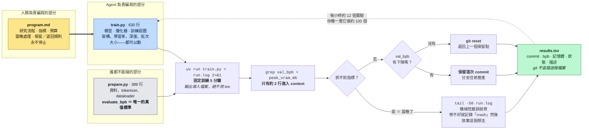

# auto-research-map（繁體中文版）

> 🌐 [English](./auto-research-map.md) · **繁體中文**

這份文件獨立回答關於 [`karpathy/autoresearch`](https://github.com/karpathy/autoresearch) 的三個問題：它解決什麼問題？它適合什麼任務？它到底燒不燒 token？至於這個專案如何放進「迴圈 → 蜂群 → DAG → 知識圖譜」這條更大的演進路線裡，請見[主地圖](./README.zh-TW.md)。

---

## 用一張圖看懂整個迴圈

在看圖之前，先交代這個專案在做什麼。autoresearch 是 Andrej Karpathy 發佈的一個實驗性倉庫：它讓一個 AI agent 整夜不停地修改一個小型 GPT 的訓練程式碼，每改一次就訓練五分鐘，看評估指標有沒有進步——有進步就保留這次修改，沒進步就用 git 退回去。就這樣永遠循環下去。你睡覺，它做實驗。

整個設計把檔案分成三種角色，這個分工本身就是核心思想：

幾個圖上的詞先解釋清楚。`val_bpb` 是 validation bits per byte（驗證集上每個位元組的位元數），是衡量語言模型好壞的一種指標，數字愈低愈好，而且它不受詞彙表大小影響，所以不同架構的模型可以直接比較。`context` 指的是模型的上下文視窗，也就是它「當下記在腦子裡」的內容——這個空間有限而且要花錢，所以整個設計拼命避免把垃圾塞進去。`commit` 與 `git reset` 是版本控制的基本操作：前者是「存檔」，後者是「讀取上一個存檔」。

---

## 問題一：它解決什麼問題？造成了什麼影響？

**表面上的問題**很小：在一個晚上之內，不需要人類介入，替一個小型 GPT 找到更好的超參數（hyperparameters，也就是學習率、批次大小這類訓練前要人工決定的設定值）和架構微調。

**實際上的問題大得多，而且是一個記憶問題——這才是可以帶走的洞見。** 一位人類研究者做實驗時，腦子裡同時裝著：現在在驗證哪個假設、哪些路已經試過走不通、哪些參數之間會互相影響。這些東西全部存在「工作記憶」裡——睡一覺就蒸發，換一個人就歸零，完全無法移交。autoresearch 把這整套工作記憶轉換成**機器可讀、可續跑、可回溯的歷史紀錄**：每一個實驗都有它的父狀態（從哪個版本改出來的）、程式碼差異（改了什麼）、指標結果（效果如何）、以及保留或丟棄的決定（結論是什麼）。這份歷史撐得過睡眠、撐得過 context 壓縮、撐得過程序重啟，甚至撐得過換一個完全不同的模型來接手。

**第二個可以帶走的洞見：你要編寫的從來不是 `train.py`，而是 `program.md`。** 用 Karpathy 自己的軟體世代比喻來說：軟體 1.0 是人類寫下明確的指令；軟體 2.0 是用資料訓練出行為；而在這裡出現了新的東西——**用自然語言去設定一個自主運作的「組織」**。`program.md` 裡寫的是：哪些檔案可以改、哪些不能碰、指標是什麼、往哪個方向算進步、每次實驗的預算多少、當機了怎麼辦、什麼情況保留、什麼情況退回、日誌怎麼記、什麼時候該升級處理、什麼算是把想法試完了。Karpathy 說這「本質上就是一個超輕量的 skill」。

**公開報告的成果：** 兩天之內約 700 個實驗，保留下來約 20 個優化——包括 QK 正規化的縮放調整、value embedding 的正則化、AdamW 優化器的調參；一夜之間的累積收益來自批次大小、模型深度、embedding 學習率、RoPE 基頻、針對性的權重衰減、初始化尺度、以及降溫排程（warmdown schedule）。

**對「影響力」的誠實秤重：**

| 說法 | 判定 |
|---|---|
| 「它找到了 20 個真實的優化」 | ✅ 是真的——但它們是「單顆 GPU、5 分鐘預算」這個玩具環境裡的局部最優解。**不要把這些結果搬到任何其他地方用。** |
| 「94k 星星、13.3k fork 證明它有效」 | ❌ 受歡迎程度不是效能指標。正確的讀法是：**這個模式容易看懂、容易重現**——程式碼小、指標看得見、迴圈一目瞭然。這種「可讀性」本身才是真正的貢獻。 |
| 「未來的前沿研究就會這樣做」 | ⚠️ **架構**可以轉移——有界的修改、可測量的評估、可回退的操作、耐久的歷史。**外殼（harness）不能轉移。** 一顆 GPU 上能跑的迴圈，證明不了你可以安全地讓 AI 自我修改一個有分散式基礎設施、資料管線、硬體故障、單一實驗跑一週的生產級訓練平台。 |

**它為什麼能運作？四個條件，每一個都是刻意的設計決策，不是運氣：**

| 條件 | 靠什麼強制執行 | 少了它會發生什麼 |
|---|---|---|
| 產出可驗證 | `evaluate_bpb` 放在唯讀檔案裡 | Agent 開始優化自己的敘事，而不是模型 |
| 動作可回退 | `git reset` 回到上一個保留點 | 一次糟糕的實驗毒害之後所有的實驗 |
| 週期夠短 | 硬性的 5 分鐘預算 | 回饋來得太慢，來不及修正方向 |
| 環境有界 | 只有一個檔案可以編輯 | 行動空間爆炸，diff 再也審不動 |

另外有兩個第二層的設計巧思值得偷學：

- **固定的是「時間」，不是「步數」。** 因為每一輪訓練都是 5 分鐘，不管你改了什麼——換更大的模型、更寬的批次、全新的優化器——所有結果都直接可比。代價是：你的結果跟別人的硬體沒有可比性。Karpathy 是故意接受這個交換的——這個迴圈找的是「在你這台機器上、這個預算內」的最佳模型。
- **把「簡潔判準」直接寫進提示詞。** `program.md` 明講：一個要花 20 行醜程式碼才換到的 0.001 進步，**不值得保留**；一個靠「刪程式碼」得到的 0.001 進步，**絕對值得**。沒有這一條，棘輪會單調地累積複雜度——因為指標看得見損失值，看不見醜。

---

## 問題二：它實際適合什麼任務？

### 放進研究工作流程來看

| 研究階段 | 適配度 | 原因 |
|---|---|---|
| 文獻整理與綜述 | ❌ 差 | 沒有可驗證的指標，需要跨來源的事實比對。這是知識圖譜的工作，不是迴圈的工作。 |
| 假設的「產生」 | ⚠️ 弱 | 迴圈獎勵的是局部微調，會漂進狹窄的最優解。`program.md` 必須明文叫它「想深一點、去讀參考論文、嘗試更激進的改動」。新方向仍然來自人類。 |
| **超參數／架構的局部搜尋** | ✅ **完美** | 有界的搜尋面、單一純量指標、每次嘗試只要幾分鐘、回退免費。這就是甜蜜點。 |
| **實驗執行與記帳** | ✅ **完美** | 永遠不會忘記記錄、不會標錯實驗、不會搞丟父 commit。比凌晨三點的疲憊人類嚴格地更好。 |
| 消融實驗（ablation）掃描 | ✅ 強 | 在這裡是一個接一個跑；一旦加上第二顆 GPU 和共享的 DAG，就變成可以大規模平行。 |
| 結果詮釋 | ⚠️ 中 | 它能告訴你「什麼」變好了，沒辦法可靠地告訴你「為什麼」——而且它也沒有動機在乎。 |
| 論文撰寫／敘事 | ❌ 差 | 需要單一連貫的 context 和品味函數。切碎它只會讓品質退化。 |

### 通用的六問測試——照這個順序問

1. **成功可以被驗證嗎？** 不行 → **根本不要從自主化開始。** 先定義測試、評分標準、來源要求，或人類決策點。
2. **步驟穩定嗎？** 穩定 → 用鏈（chain）。不穩定 → 需要規劃或協調者。
3. **子任務彼此獨立嗎？** 獨立 → 平行化。不獨立 → 明確建模依賴關係，並限制同時寫入。
4. **失敗的支線需要留著嗎？** 需要 → 用 DAG，不要強迫一切合併回單一主幹。
5. **事實需要活過這一輪執行嗎？** 需要 → 持久化 artifacts 和圖狀態，**不要依賴對話摘要**。
6. **成本和延遲付得起嗎？** 在加 worker **之前**先設好預算。

### 架構的階梯

| 情境 | 從這裡開始 |
|---|---|
| 簡單、低風險的問題 | 一次呼叫（zero-shot） |
| **產出可以被檢驗** | **迴圈——autoresearch 就在這一格** |
| 順序固定 | 鏈 |
| 分類明確 | 路由器 |
| 單元彼此獨立 | 平行化 |
| 拆解方式多變 | 協調者—工作者 |
| 替代路線必須保留 | Commit DAG |
| 事實必須跨場次存活 | 知識圖譜 |
| 超大規模平行工作 | 動態工作流 |

### 它在哪裡失效

- **指標可以被鑽漏洞。** 棘輪只會改善它看得見的那個指標。它樂意拿推論成本、穩健性、泛化能力去換驗證損失的下降——這正是為什麼 VRAM 被保留為軟約束、簡潔判準被寫進提示詞。
- **一顆 GPU 不是一座叢集。** 分散式基礎設施、資料管線、硬體故障、多目標權衡、跑一週的實驗——全都不在這個模型裡。
- **耦合的工作被切碎就退化。** 架構設計、敘事寫作、緊密耦合的重構、微妙的產品判斷——這些需要單一連貫的 context。

---

## 問題三：它到底燒不燒 token？

**按小時算：不燒——它是你能跑的自主迴圈裡數一數二省的，因為瓶頸在 GPU，不在模型。但按絕對值算：燒——因為它被設計成永不停止。**

### 讓它便宜的三個刻意選擇

1. **`> run.log 2>&1`，明文禁止 `tee`。** `program.md` 把理由寫得清清楚楚：「不要用 tee，不要讓輸出淹沒你的 context。」每次訓練吐出幾百行日誌，進入 context 的是零行。
2. **讀結果只用 grep 抓兩行**（約 20 個 token）。完整日誌只有在當機時才讀，而且只讀 `tail -n 50`。
3. **每一輪有 5 分鐘的死等。** GPU 在跑的時候，模型什麼都不做。工作週期（duty cycle）大約只有 20–30%：每個 5 分鐘的實驗裡，模型實際工作 30 到 90 秒。對照一般的 coding agent——幾乎 100% 工作週期，還把編譯輸出直接灌進 context。**autoresearch 的大部分時鐘時間，是不花你半毛錢的。**

### 具體的算術

一次性的 context 載入：`README.md`（8.0 KB）＋ `prepare.py`（15.0 KB）＋ `train.py`（26.2 KB）＋ `program.md`（7.0 KB）≈ **15.5k tokens**。

每個實驗需要 5 到 14 個助手回合（檢視 → 編輯 → commit → 執行 → grep → 記錄 → 保留或退回）。每個回合都要重送整段對話，所以**輸入端被快取讀取（cache read）主導**；對話每經過一個實驗大約增長 2–7k tokens，直到壓縮為止。

| | 精省 低 effort、乾淨的運行 | 典型 | 重度 最高 effort、頻繁除錯 |
|---|---|---|---|
| 回合數／實驗 | ~5 | ~8 | ~14 |
| 平均攜帶的 context | ~40k | ~90k | ~150k |
| **輸入 tokens／實驗** | ~200k | ~700k | ~2.1M |
| **輸出 tokens／實驗** | ~1.5k | ~4k | ~10k |
| **成本／實驗** | **~$0.25** | **~$0.85** | **~$2.40** |
| 過夜（約 100 個實驗） | ~$25 | ~$85 | ~$240 |
| 完整運行（約 700 個實驗／2 天） | ~$175 | ~$600 | ~$1,700 |
| 輸出 tokens，完整運行 | ~1M | ~2.8M | ~7M |

計價基礎：Claude Opus 5 牌價——**每百萬輸入／輸出 tokens $5／$25**，快取讀取 **0.1 倍**（$0.50/M），快取寫入 **1.25 倍**（$6.25/M）——並假設輸入端為現實的 90% 快取讀取／5% 快取寫入／5% 全新的分佈。用 Sonnet 級模型大約砍半；調低 effort 設定會讓你直接往「精省」那一欄移動。**這些是從檔案大小和迴圈結構推算的估計值，不是實際運行的量測值。**

### 真正一錘定音的比較

| 資源（8 小時過夜） | 成本 |
|---|---|
| H100 隨需租用 | ~$16–$25 |
| **Agent tokens** | **~$25–$240** |

**同一個數量級。** 所以正確的心態是：把 token 當成跟 GPU 同級的預算項目來編列，而不是事後才想到的雜支——但這也不是失控的支出。

### 想壓成本？五根槓桿，從最便宜的開始

1. **調低 effort 設定。** 單一最大槓桿，直接往表格下方移動。
2. **給運行加上限。** `program.md` 寫著「永不停止」是刻意設計——讓帳單變大的是那句話，不是 token 費率。用時鐘時間或實驗數量把它包起來。
3. **守住日誌紀律。** 永遠不用 `tee`，成功時永遠不讀 `run.log`。倉庫裡本來就是對的，不要「改良」它。
4. **盯緊當機迴圈。** 一個會當機的想法要花一次 `tail -50` 加一次修復嘗試，而且**沒有 5 分鐘死等**——當機是昂貴的路徑。這正是 `program.md` 說「試幾次修不好就放棄」的原因。
5. **積極壓縮。** 輸入規模 ＝ 攜帶的 context × 回合數；這個乘積是主導項。

### 最後的誠實警語

**這是便宜的那一端。** 一旦你走上自然的下一步——蜂群、扇出（fan-out）、驗證波——經濟學就翻轉了。Anthropic 的 Dynamic Workflows 可以同時生出 16 個子 agent、單一工作流硬上限 1,000 個，而且官方自己說「一次 1,000 子 agent 的高 effort 運行可能花費數十美元」——**是每一次運行、在幾分鐘之內，不是過一夜。** 平行的 worker 還會產生**相關性錯誤**（correlated errors，大家犯同樣的錯）：你加上去補救的驗證波，只有在審查者拿到不同的提示詞、不同的證據集、或不同的角色時才有用。

autoresearch 是這個設計空間裡最節儉的一端。它不是有代表性的那一端。

---

*倉庫數據於 2026-08-18 以 `gh` 即時抓取：94,030 stars、13,325 forks、MIT 授權、建立於 2026-03-06、最後推送 2026-03-26。*
